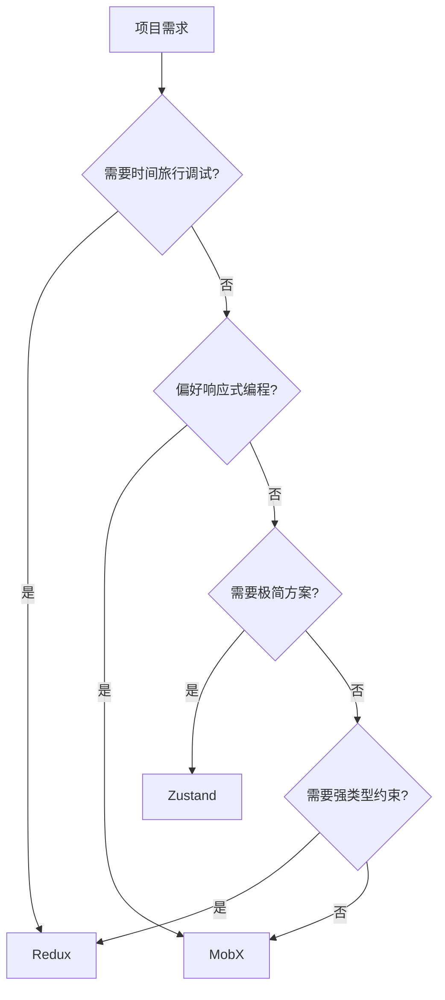

以下是 Redux、Zustand 和 MobX 的深度对比分析，从设计理念到实际应用场景的全方位对比：

---

### 一、设计哲学对比
#### 1. Redux (Flux 架构的严格实现)
- **核心思想**：单向数据流 + 不可变状态树
- **强制规范**：
  - 单一数据源（Single Source of Truth）
  - 状态只读（通过 action 修改）
  - 纯函数 reducer 处理变更
- **设计目标**：可预测的状态管理 + 完备的DevTools支持

#### 2. Zustand (极简主义)
- **核心思想**：基于 React Context + Hooks 的轻量化封装
- **设计特点**：
  - 去中心化的多 store 支持
  - 可变状态更新（类似 useState）
  - 自动处理渲染优化
- **设计目标**：用最小API实现高效状态共享

#### 3. MobX (响应式编程典范)
- **核心思想**：观察者模式 + 自动依赖追踪
- **核心机制**：
  - 可观察状态 (Observables)
  - 自动派生值 (Computed values)
  - 副作用自动触发 (Reactions)
- **设计目标**：通过透明函数式响应编程实现高效状态同步

---

### 二、核心概念对比
|                  | Redux                 | Zustand              | MobX                  |
|-------------------|-----------------------|----------------------|-----------------------|
| **状态存储**      | 单一 store            | 多 store 支持        | 多 store 推荐         |
| **状态更新方式**  | dispatch(action)      | 直接修改             | 直接修改 observable   |
| **不可变性**      | 强制不可变            | 可变                 | 可变                  |
| **异步处理**      | 需要中间件            | 原生支持             | 自动追踪异步操作      |
| **依赖追踪**      | 手动订阅              | 自动细粒度订阅       | 自动依赖追踪          |
| **类型系统**      | 严格类型定义          | 灵活类型推断         | 装饰器类型支持        |

---

### 三、典型代码结构对比
#### 1. Redux 计数器实现
```javascript
// action
const increment = () => ({ type: 'INCREMENT' })

// reducer
const counter = (state = 0, action) => {
  switch(action.type) {
    case 'INCREMENT': return state + 1
    default: return state
  }
}

// store
const store = configureStore({ reducer: counter })

// 组件使用
dispatch(increment())
```

#### 2. Zustand 计数器实现
```javascript
const useStore = create((set) => ({
  count: 0,
  increment: () => set(state => ({ count: state.count + 1 }))
}))

// 组件使用
const { count, increment } = useStore()
```

#### 3. MobX 计数器实现
```javascript
class CounterStore {
  @observable count = 0

  @action increment = () => {
    this.count += 1
  }
}

// 组件使用
const { count, increment } = useCounterStore()
```

---

### 四、性能特征对比
| **维度**         | Redux                     | Zustand                   | MobX                      |
|------------------|---------------------------|---------------------------|---------------------------|
| **更新机制**     | 全量浅比较                | 细粒度属性订阅            | 依赖追踪精确更新          |
| **渲染优化**     | 需要手动优化              | 自动跳过无关组件渲染      | 自动精确更新相关组件      |
| **内存占用**     | 较高（历史状态保存）      | 较低                      | 中等                      |
| **大型数据**     | 需要分形归一化处理        | 天然支持局部状态          | 自动处理嵌套结构          |

---

### 五、开发体验对比
#### 1. Redux
- **优势**：
  - 严格的类型安全（配合 TypeScript）
  - 时间旅行调试能力
  - 丰富的中间件生态（redux-thunk, redux-saga）
- **痛点**：
  - 样板代码问题（Redux Toolkit 已缓解）
  - 学习曲线陡峭（需要理解 middleware/reducer 等概念）

#### 2. Zustand
- **优势**：
  - 近乎零学习成本（类似 useState 体验）
  - 灵活的 store 组织方式
  - 内置不可变更新工具（immer 集成）
- **痛点**：
  - 缺乏官方中间件体系
  - 复杂场景调试能力有限

#### 3. MobX
- **优势**：
  - 直观的响应式编程体验
  - 自动优化的渲染机制
  - 强大的派生状态管理（computed）
- **痛点**：
  - 装饰器语法存在争议
  - 过度自动化可能导致意外行为
  - TypeScript 集成复杂度较高

---

### 六、适用场景推荐
#### 1. 选择 Redux 当：
- 需要严格的状态变更历史追踪
- 大型团队需要强规范约束
- 复杂的状态管理中间件需求
- 项目已存在 Redux 生态集成

#### 2. 选择 Zustand 当：
- 中小型项目需要快速实现状态共享
- 开发团队偏好 hooks 风格
- 需要轻量级解决方案
- 希望避免过度设计

#### 3. 选择 MobX 当：
- 需要实现复杂响应式逻辑
- 涉及大量派生状态计算
- 偏好面向对象模式
- 需要自动化的渲染优化

---

### 七、趋势与生态
| **指标**         | Redux            | Zustand         | MobX            |
|------------------|------------------|-----------------|-----------------|
| **npm 周下载量** | 7M+              | 1.2M+           | 2.3M+           |
| **Bundle 大小**  | 2.6KB (RTK)      | 1.6KB           | 16.7KB          |
| **学习曲线**     | 陡峭             | 平缓            | 中等            |
| **社区活跃度**   | 成熟稳定         | 快速上升        | 平稳发展        |

---

### 八、决策树参考


---

### 总结建议：
- **保守型大型项目**：Redux + Redux Toolkit + RTK Query
- **现代中型应用**：Zustand + React Query
- **复杂交互系统**：MobX + MST(MobX State Tree)
- **微前端架构**：Zustand（子应用） + Redux（主应用）

每个方案都有其最佳适用场景，建议根据团队技术栈熟悉度、项目规模和特定功能需求综合考量。对于新项目，可以从 Zustand 起步，随复杂度增长逐步引入更结构化的方案。