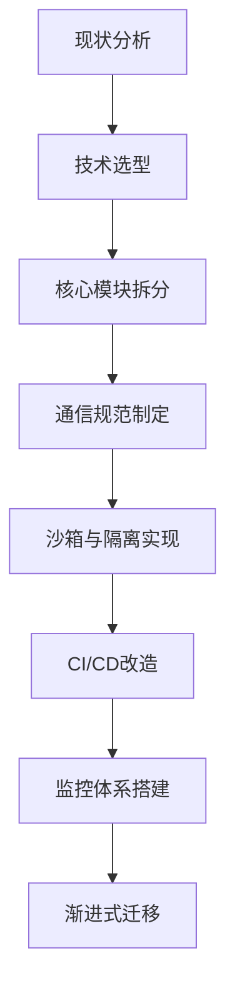

# 微前端

下面从微前端的**核心思想**、**架构模式**、**关键技术**、**实施难点**、**行业实践**等多个维度进行深度解析，并结合实际案例说明其应用场景和解决方案。以下为系统性讲解：

---

## 一、微前端的本质与核心思想
### 1.1 定义与目标
微前端（Micro Frontends）是将微服务理念扩展到前端领域的架构模式，核心目标是通过**技术解耦**和**组织解耦**，实现以下能力：
- **独立开发**：不同团队可并行开发、部署子应用
- **技术异构**：支持混合使用React/Vue/Angular等技术栈
- **渐进升级**：逐步替换遗留系统，避免全量重构风险

### 1.2 与微服务的核心差异
| 维度         | 微服务                   | 微前端                     |
|--------------|--------------------------|--------------------------|
| 运行环境     | 服务端独立进程           | 浏览器同一页面           |
| 通信方式     | HTTP/gRPC等网络协议      | CustomEvent/Window对象   |
| 状态管理     | 服务端无状态             | 需处理客户端状态同步     |
| 部署单元     | 独立服务                 | 独立前端应用             |

---

## 二、微前端架构模式详解
### 2.1 路由分发式（主流方案）

- **核心机制**：主应用根据URL路由动态加载子应用
- **典型场景**：不同业务域对应不同子应用（如电商平台的商品/订单/用户中心）
- **技术实现**：
  ```javascript
  // 主应用路由配置
  registerMicroApps([
    {
      name: 'product',
      entry: '//product.example.com',
      container: '#subapp-container',
      activeRule: '/product'
    },
    {
      name: 'order',
      entry: '//order.example.com',
      container: '#subapp-container',
      activeRule: '/order'
    }
  ]);
  ```

### 2.2 组合式架构

- **核心机制**：页面由多个独立组件组合而成
- **典型场景**：Dashboard类应用（各图表/卡片来自不同子应用）
- **实现难点**：
  - 组件版本兼容性
  - 跨组件状态共享
  - 样式隔离

### 2.3 边缘服务组装（SSR场景）
- **核心机制**：通过CDN边缘节点拼接HTML片段
- **技术方案**：使用Webpack 5的Module Federation
  ```javascript
  // host应用配置
  new ModuleFederationPlugin({
    name: "host",
    remotes: {
      product: "product@http://cdn.com/product/remoteEntry.js"
    }
  });
  
  // 动态加载
  import("product/ProductList").then(module => {
    render(module.default);
  });
  ```

---

## 三、关键技术实现方案
### 3.1 应用隔离
#### 3.1.1 JS沙箱
| 方案              | 原理                           | 优缺点                     |
|-------------------|-------------------------------|--------------------------|
| Proxy沙箱        | 使用Proxy劫持window对象        | 兼容性好，但性能损耗5-8%  |
| Snapshot沙箱     | 快照/恢复全局对象              | 快照内存占用高            |
| Iframe沙箱       | 天然隔离环境                   | 通信复杂，样式难以统一     |

**Proxy沙箱实现示例**：
```javascript
class Sandbox {
  constructor() {
    this.fakeWindow = {};
    this.proxy = new Proxy(this.fakeWindow, {
      get(target, key) {
        return target[key] || window[key];
      },
      set(target, key, value) {
        target[key] = value;
        return true;
      }
    });
  }
}
```

#### 3.1.2 CSS隔离
| 方案                | 实现方式                     | 适用场景               |
|---------------------|----------------------------|----------------------|
| Shadow DOM          | 浏览器原生隔离              | 高隔离要求场景         |
| CSS命名空间         | 前缀约定（如app1-btn）       | 简单项目              |
| PostCSS插件         | 自动添加作用域前缀           | 需要自动化处理         |
| Runtime样式移除     | 卸载子应用时清除style标签    | 动态加载场景          |

---

### 3.2 通信机制
#### 3.2.1 父子应用通信
```javascript
// 主应用发布事件
window.dispatchEvent(new CustomEvent('global-event', {
  detail: { type: 'USER_LOGIN', data: userInfo }
}));

// 子应用监听
window.addEventListener('global-event', e => {
  if (e.detail.type === 'USER_LOGIN') {
    updateUser(e.detail.data);
  }
});
```

#### 3.2.2 跨应用状态共享
```javascript
// 使用Redux实现共享Store
const store = createStore(reducer);

// 主应用注入
window.__MICRO_FRONTEND_STORE__ = store;

// 子应用使用
const store = window.__MICRO_FRONTEND_STORE__;
store.dispatch({ type: 'UPDATE' });
```

---

### 3.3 资源加载优化
#### 3.3.1 预加载策略
```html
<!-- 主应用预加载子应用资源 -->
<link rel="prefetch" href="//subapp.com/static/js/main.js" as="script">
```

#### 3.3.2 按需加载
```javascript
// 动态加载子应用
function loadApp(name) {
  return import(`./apps/${name}.js`)
    .then(module => module.init())
    .catch(err => console.error('加载失败:', err));
}
```

---

## 四、实施难点与解决方案
### 4.1 版本冲突问题
| 冲突类型       | 解决方案                     | 技术实现示例                |
|---------------|----------------------------|---------------------------|
| React多实例   | 共享依赖                     | Webpack externals         |
| CSS变量污染   | 命名空间隔离                 | CSS-in-JS方案             |
| 全局API覆盖   | 沙箱代理                     | 如3.1.1的Proxy沙箱        |

### 4.2 性能监控体系
```javascript
// 统一性能上报
const perf = {
  subappLoadStart: {},
  report() {
    window.performance.getEntries()
      .filter(entry => entry.name.includes('micro-app'))
      .forEach(entry => {
        sendToAnalytics({
          name: entry.name,
          duration: entry.duration
        });
      });
  }
};

// 子应用装载时记录
window.performance.mark('micro-app-start');
```

---

## 五、行业最佳实践案例
### 5.1 阿里乾坤方案

```
                ┌──────────────────────┐
                │      主应用（Main）     │
                │  - 路由控制中心        │
                │  - 全局状态管理        │
                │  - 子应用加载器        │
                └──────────┬───────────┘
                           │
        ┌──────────────────┼──────────────────┐
        │                  │                  │
        ▼                  ▼                  ▼
┌─────────────────┐ ┌─────────────────┐ ┌─────────────────┐
│   子应用A        │ │   子应用B        │ │   子应用C        │
│  - 独立技术栈     │ │  - 独立仓库       │ │  - 独立部署       │
│  - 自主开发/部署   │ │  - 按需加载       │ │  - 沙箱隔离       │
└─────────────────┘ └─────────────────┘ └─────────────────┘
```
- **核心特点**：
  - 基于Single-SPA封装
  - 完备的沙箱体系
  - 支持IE11
- **典型配置**：
  ```javascript
  import { registerMicroApps, start } from 'qiankun';
  
  registerMicroApps([...]);
  start({ prefetch: 'all' });
  ```

### 5.2 美团MPA微前端
- **场景特点**：
  - 多个独立SPA应用
  - 需要共享登录态
  - 渐进式迁移
- **技术方案**：
  ```nginx
  # Nginx路由配置
  location /legacy {
    proxy_pass http://old-system;
  }
  
  location /new {
    proxy_pass http://micro-frontend;
  }
  ```

---

## 六、微前端适用性评估
### 6.1 适合场景
- ✅ 大型平台型产品（如阿里云控制台）
- ✅ 多团队协作开发
- ✅ 遗留系统渐进改造
- ✅ 需要混合多技术栈

### 6.2 不适合场景
- ❌ 小型单页应用（引入复杂度得不偿失）
- ❌ 强交互耦合的业务模块
- ❌ 对性能极致要求的场景（首屏可能增加100-300ms）

---

## 七、实施路线图建议


---

## 八、未来发展趋势
1. **Serverless集成**：通过边缘函数实现动态组合
2. **Web Components深化**：原生组件标准化
3. **低代码融合**：可视化组装微前端模块
4. **智能化加载**：基于用户行为的预测加载

---

通过以上系统化拆解，可以看出微前端不是简单的技术堆砌，而是需要结合**架构设计**、**工程规范**、**组织协作**的综合解决方案。实际落地时建议采用小步快跑策略，先从非核心业务模块试点，逐步积累经验后再扩大实施范围。